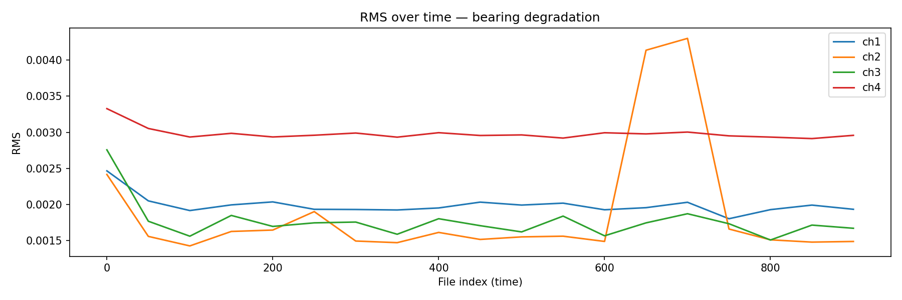

# Predictive Maintenance Pipeline

End-to-end MLOps pipeline for industrial bearing fault detection using real sensor data.



## Overview

This project builds a production-style predictive maintenance system on the NASA Bearing Dataset. It simulates a real industrial IoT pipeline: streaming ingestion → feature engineering → anomaly detection → model serving → live dashboard.

## Architecture

NASA Bearing Data → Kafka Simulation → PostgreSQL
↓
Feature Engineering
(RMS, Kurtosis, FFT)
↓
┌─────────────────────────┐
│ Isolation Forest │
│ Autoencoder (PyTorch) │
│ MLflow Tracking │
└─────────────────────────┘
↓
FastAPI /predict
↓
Streamlit Dashboard

## Tech Stack

| Layer               | Tool                  |
| ------------------- | --------------------- |
| Data ingestion      | Python, PostgreSQL    |
| Feature engineering | pandas, numpy, scipy  |
| Anomaly detection   | scikit-learn, PyTorch |
| Experiment tracking | MLflow                |
| Model serving       | FastAPI, Uvicorn      |
| Deployment          | Docker                |
| Dashboard           | Streamlit             |

## Results

- 19 feature windows extracted from 984 sensor recordings
- Isolation Forest detected 2 anomalies (contamination=0.10)
- Autoencoder reconstruction error spikes clearly near bearing failure
- Both models agree on consensus anomaly label via `/predict` endpoint

## Quick Start

### 1. Clone and set up environment

```bash
git clone https://github.com/YOUR_USERNAME/predictive-maintenance-pipeline.git
cd predictive-maintenance-pipeline
conda create -n pm-pipeline python=3.11
conda activate pm-pipeline
pip install -r requirements.txt
```

### 2. Set up PostgreSQL

- Install PostgreSQL and create a database called `bearing_db`
- Update `DB_URL` in all scripts with your password

### 3. Download the dataset

Download the NASA Bearing Dataset (`2nd_test`) from Kaggle and place files at `data/raw/bearing/`.

### 4. Run the pipeline

```bash
# Ingest data
python src/ingest/kafka_consumer.py

# Engineer features
python src/features/compute_features.py

# Train models
python src/models/train_isolation_forest.py
python src/models/train_autoencoder.py

# Serve
uvicorn src.api.main:app --reload

# Dashboard
streamlit run src/dashboard/app.py
```

### 5. Docker

```bash
docker build -t pm-pipeline .
docker run -p 8000:8000 pm-pipeline
```

## API

`POST /predict` — accepts 26 sensor features, returns anomaly labels from both models.

```json
{
  "features": [0.1, 0.05, 3.1, 1.4, ...]
}
```

Response:

```json
{
  "isolation_forest": { "score": -0.21, "label": "anomaly" },
  "autoencoder": { "reconstruction_error": 0.003, "label": "normal" },
  "consensus": "anomaly"
}
```

## Project Structure

├── data/raw/bearing/ ← NASA sensor files
├── src/
│ ├── ingest/ ← Kafka simulation, PostgreSQL ingestion
│ ├── features/ ← Feature engineering
│ ├── models/ ← Isolation Forest, Autoencoder training
│ ├── api/ ← FastAPI serving
│ └── dashboard/ ← Streamlit dashboard
├── notebooks/ ← EDA plots
├── Dockerfile
└── requirements.txt

## Author

Rayan Baderdine
